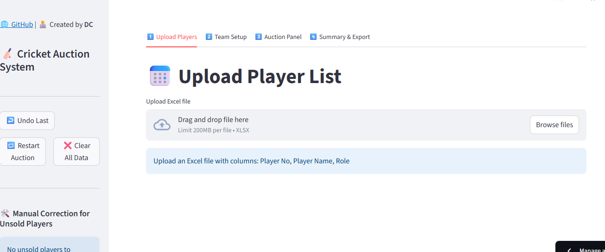

# 🏏 Cricket Player Auction App

 
 
 
 


A **Python and Streamlit-based cricket player auction app** designed to simplify team selection and player bidding for local or fantasy cricket tournaments.

---

## 🌐 Live Demo
Access the live app here: [Cricket Auction App](https://cricketauctionapp.streamlit.app/)

---

## 🎬 Preview

### App Screenshot


### Live Auction Panel GIF


---

## ⚡ Features

- **Upload Players**: Import player lists from Excel with flexible, case-insensitive column matching.  
- **Team Setup**: Create multiple teams with custom names and assigned budgets.  
- **Auction Panel**: Randomly pick players, record bids, and mark them as sold or unsold.  
- **Manual Correction**: Adjust unsold players manually, assign them to teams, and update prices.  
- **Live Metrics**: Track total players, pending auctions, and players auctioned in real-time.  
- **Undo & Restart**: Undo the last action or restart the auction anytime.  
- **Budget Overview**: Clear summary of team budgets including spent and remaining funds.  
- **Export Excel**: Download detailed auction results with combined and team-wise player lists, including sold prices.  

---

## 💻 Installation

1. **Install Python** (3.8 or above recommended).  
2. **Install required packages**:

```bash
pip install streamlit pandas openpyxl
```

3. **Clone the repository**:

```bash
git clone https://github.com/deveshc20/Cricket-Auction-App.git
cd Cricket-Auction-App
```

4. **Run the app**:

```bash
streamlit run app.py
```

---

## 📄 License
This project is licensed under the [MIT License](https://opensource.org/licenses/MIT).

---

## 👤 About
Created by **Devesh Chaudhari**  
GitHub: [deveshc20](https://github.com/deveshc20/Cricket-Auction-App)

Enjoy managing your cricket auctions efficiently! 🎉